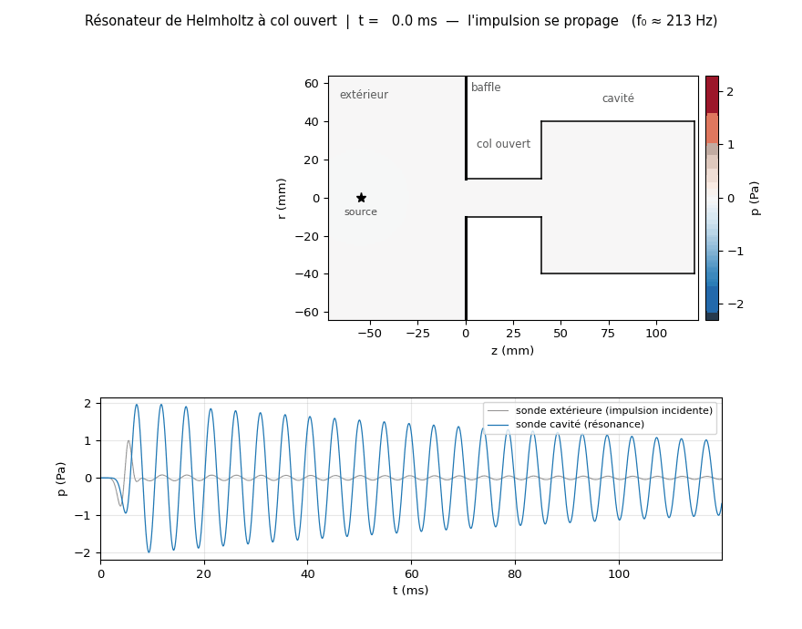

# Résonateur de Helmholtz — étude numérique par différences finies

Étude numérique d'un résonateur de Helmholtz axisymétrique, en trois volets :

| # | Notebook | Question | Résultat vérifié |
|---|---|---|---|
| **1** | `etude_helmholtz.ipynb` | Où est la résonance et de quoi dépend-elle ? | V&V complète : MMS ordre **2,03**, GCI **≈2 %**, validation Selamet **0,6 / 2,2 %** |
| **2** | `resonance_transitoire.ipynb` | À quoi ressemble la résonance **en temps réel** ? | col ouvert + extérieur maillé → **f₀ = 204,6 Hz** (extrapolée, GCI 1,5 %), à **0,47 %** de la formule corrigée |
| **3** | `bench_bases.py`, `train_pinn_freq.py` | Un réseau peut-il remplacer le solveur ? | **non en l'état** — verrou identifié et mesuré, un résultat partiel à **20,7 %** |



*L'impulsion se propage, entre par le col, la cavité se remplit — puis l'impulsion repart et la
cavité **sonne seule** à sa fréquence propre. Volet 2.*

## Démarrage

```bash
pip install -r requirements.txt
jupyter lab etude_helmholtz.ipynb          # volet 1 — FDM / V&V
jupyter lab resonance_transitoire.ipynb    # volet 2 — résonance en transitoire
```

Les notebooks sont livrés **avec leurs sorties** (figures visibles sans rien exécuter).

---

## Volet 1 — FDM : vérification, validation, longueur effective

| Niveau | Question | Méthode | Résultat |
|---|---|---|---|
| **Code** | le schéma est-il bien programmé ? | solution manufacturée (MMS) | ordre **2,03** |
| **Solution** | l'erreur de maillage est-elle bornée ? | convergence GCI (Roache) + 4ᵉ grille | incertitude **≈ 2 %** |
| **Modèle** | reproduit-il la réalité ? | mesures publiées (Selamet *et al.* 1997) | écarts **0,6 % / 2,2 %** |

- **Loi d'échelle** : après propagation de l'incertitude numérique, loi de puissance et modèle à
  longueur effective sont statistiquement indiscernables (ΔAICc non décisif) ; le modèle physique
  `f₀ = A_H/√(L+ΔL_eff)` est préféré (**A_H ≈ 48**, **ΔL_eff ≈ 0,66 R_col**, prédiction
  leave-one-out 10× meilleure). L'exposant apparent *b ≈ −0,42* est un artefact de plage restreinte.
- **Correction de bout** décomposée intérieur/extérieur via une condition d'impédance de rayonnement.
- **Pertes** dominées par la couche limite du col (**Q ≈ 47**) ; absorption volumique négligeable.

## Volet 2 — Résonance en régime transitoire (col ouvert, extérieur maillé)

Le col est **réellement ouvert** sur un demi-espace extérieur **maillé** (baffle plan, couches
absorbantes), excité par une **impulsion large bande**. Le résonateur **sélectionne** sa fréquence
propre : après le passage de l'impulsion, la cavité continue d'osciller.

| Grandeur | Mesuré | Référence | Écart |
|---|---|---|---|
| f₀ **extrapolée à maillage nul** | **204,6 Hz** (GCI 1,5 %) | Helmholtz **avec** corrections de bout : 205,6 Hz | **0,47 %** |
| — | — | Helmholtz **sans** correction : 241,3 Hz | 15 % |
| Ordre de convergence observé | 0,86 | 3 grilles : 2 / 1 / 0,5 mm | — |
| Q par rayonnement | **non mesurable ici** | varie d'un facteur 6 selon les frontières | artefact numérique |

Le maillage extérieur **calcule** la correction de bout au lieu de la postuler : c'est la
**perspective n°1** du projet, désormais réalisée.

**Vérification (ajoutée après coup, et elle corrige deux résultats).** Le solveur place ses parois
une demi-maille au-delà du dernier nœud — la géométrie simulée vaut donc `R+h/2` et `H+h`, ce qui
biaise f₀ au premier ordre. Trois conséquences :

- la fréquence brute à h=1 mm (209,8 Hz) semblait coïncider avec le calcul fréquentiel par
  impédance (209,84 Hz) ; cette coïncidence était **fortuite**, due au biais de maillage ;
- une fois extrapolée, f₀ = **204,6 Hz**, à 0,47 % de la théorie corrigée — un accord plus faible
  en apparence, mais cette fois **contrôlé** et assorti d'une incertitude ;
- f₀ est **parfaitement robuste** au traitement des frontières (variation 0,00 %), alors que **Q
  varie d'un facteur 6** : ce calcul mesure une fréquence propre, pas un amortissement.

Vérification de code : `mms_transient.py` (solution manufacturée espace-temps, **ordre 1,98**),
qui teste le masque, les flux nuls et l'axe — ce que la MMS du volet 1 ne couvrait pas.


## Volet 3 — Réseaux informés par la physique : ce qui bloque, et pourquoi

Seize expériences, dont **quatre parades réfutées avec mesures**. Le résultat de ce volet
n'est pas un solveur, c'est un **diagnostic chiffré** — et un banc d'essai qui permet de
trancher en deux minutes des questions qui coûtaient une heure de calcul chacune.

### Le verrou, en une mesure

| θ testé | erreur sur le **champ** | résidu d'**EDP** |
|---|---|---|
| meilleure projection du champ FDM | **0,17 %** | **363 138 %** |
| champ trouvé par les moindres carrés | 100,01 % | **0,054 %** |

Le minimum de l'objectif **n'est pas près de la vérité**. Représenter `P` à 0,17 % ne suffit
pas : le laplacien amplifie l'erreur de représentation par `1/L² = 625`, et la solution vraie
vit sur une quasi-annulation entre deux grands termes. C'est aussi pourquoi le FDM y arrive en
0,1 s — il ne représente pas `P` pour ensuite le dériver.

### Le banc d'essai des bases

`bench_bases.py` (harmonique) et `bench_transient.py` (transitoire) comparent six familles de
fonctions **sans aucun entraînement**, sur la capacité et sur le résidu qu'elles produisent.

| base | proj. de P | résidu | κ(A) |
|---|---|---|---|
| tanh | 0,36 % | 997 875 % | 6,8·10¹³ |
| SiLU / Swish | 0,57 % | — | **2,6·10¹⁶** *(pire que tanh)* |
| sine ω₀ = 8 (SIREN) | 0,26 % | 711 862 % | **5,1·10²** |
| Gabor étroit | **0,15 %** | **253 570 %** | 2,3·10⁴ |
| décomposition de domaine | 0,16 % | 425 392 % | 3,9·10³ |
| **Trefftz (Bessel)** | 4,04 % | **0 %, exact** | — |

Enseignements : **SiLU est un piège** (rang effectif 43/96) ; **sine ω₀=8 gagne onze ordres de
conditionnement** à capacité égale ; et **la décomposition de domaine n'apporte rien de
mesurable** — même conclusion dans les deux formulations. Seul Trefftz change d'ordre de
grandeur, parce que `lap(φ) + k²φ = 0` y est vrai **par construction**.

### Le seul résultat qui tient

`train_pinn_freq.py` — réseau paramétré par la fréquence, `(r,z,f) → P` complexe, sur la bande
150–300 Hz : **six fréquences sur neuf sous le score du champ nul**, jusqu'à **20,65 %**, avec
l'amplitude à 8 % du FDM aux extrémités. Et surtout, la **sélection du modèle s'est faite sans
jamais regarder le FDM** (corrélation perte/erreur +0,598, p = 0,005) — ce qui en fait un
résultat et non un bon coup repéré avec le corrigé.

L'erreur croît de façon monotone à l'approche du pôle et s'effondre à 3,6 Hz de la résonance :
la signature de l'opérateur qui devient singulier.

### Références triviales — aucune annonce sans elles

| référence | coût | score |
|---|---|---|
| champ nul `p = 0` | 0 s | 100 % par construction |
| champ incident analytique `p = p₀` | 1 ligne | **59,7 %** à l'extérieur |
| cible analytique, cavité fermée | 1 s | **0,9 %** |
| solveur FDM direct | **0,10 s** par fréquence | référence |

Elles ont invalidé **trois résultats** de ce projet, dont un PINN annoncé à 4,7 % que battait
une cible analytique sans réseau.

**Le rapport complet — 20 pages, tous les résultats, tous les échecs, tous les diagnostics et
les voies de sortie — est dans [`RAPPORT_PINN_Helmholtz.pdf`](RAPPORT_PINN_Helmholtz.pdf).**

## Reproduire

```bash
python fdm_open_resonator.py          # volet 2 : résonance (~6 min)
python mms_transient.py               # vérification de code du transitoire (~10 s)
python convergence_f0.py              # convergence en maillage de f0
python make_resonance_anim.py         # animation (après un run OR_TAG=_anim, cf. notebook)
python make_mode_anim.py              # animation du mode résonant établi (~30 s)

python bench_bases.py                 # volet 3 : banc des bases, harmonique   (~2 min)
python bench_transient.py             # volet 3 : banc des bases, transitoire  (~2 min)
PF_FMIN=150 PF_FMAX=300 PF_ITERS=800 PF_RCOND=1e-8 python train_pinn_freq.py
```

## Contenu

```
etude_helmholtz.ipynb          volet 1 — FDM fréquentiel, V&V, longueur effective
resonance_transitoire.ipynb    volet 2 — résonance transitoire (col ouvert)
fdm_open_resonator.py          solveur transitoire col ouvert + extérieur maillé
mms_transient.py               vérification de code du transitoire (MMS espace-temps)
convergence_f0.py              convergence en maillage de f0 + extrapolation
make_resonance_anim.py         animation du régime transitoire
make_mode_anim.py              animation du mode résonant établi (quadrature col/cavité)
build_resonance_notebook.py    génération du notebook du volet 2

bench_bases.py                 volet 3 — banc des bases, cas harmonique
bench_transient.py             volet 3 — banc des bases, cas transitoire
train_pinn_freq.py             volet 3 — PINN paramétré par la fréquence (fonctionne)
train_pinn_open.py             volet 3 — PINN transitoire (causal, moindres carrés, ancrage)
train_pinn_scattered.py        volet 3 — champ diffracté + bilans d'énergie
trefftz_match.py               volet 3 — Trefftz par sous-domaine (en cours)
RAPPORT_PINN_Helmholtz.pdf     rapport complet, 20 pages
data/  plots/                  données et figures
docs/PROTOCOLE_EXPERIMENTAL.md protocole de mesure sur résonateur réel
```

## Perspectives

**Côté FDM** : PML formelle au lieu des couches absorbantes ; pertes viscothermiques résolues
dans le transitoire ; col émergeant sans baffle ; campagne expérimentale (cf. `docs/`).
Le facteur de qualité reste non tranché — 285,6 par impédance analytique contre 105 par
extérieur maillé : ce projet mesure très bien une fréquence propre, et mal un amortissement.

**Côté réseaux** : la seule direction qui change d'ordre de grandeur est **Trefftz par
sous-domaine** — modes de Bessel du col et de la cavité, raccordés à l'interface, ce qui est
le *mode matching* classique. `trefftz_match.py` en pose la structure ; il lui manque
l'enrichissement de la singularité du coin rentrant de 270°, où le champ varie en `r^(2/3)` et
son gradient diverge en `r^(-1/3)`. Le raccord y converge en `1/n` sans cet enrichissement,
et la résonance amplifie l'erreur de bord par ~2500.
