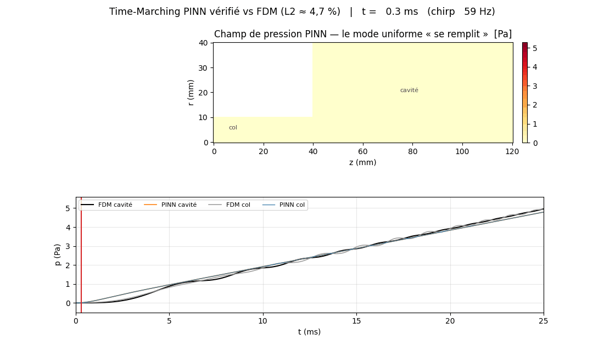

# Résonateur de Helmholtz — étude numérique (FDM + PINN transitoire)

Deux volets numériques autour d'un résonateur de Helmholtz axisymétrique :

1. **Étude FDM & V&V** (`etude_helmholtz.ipynb`) — solveur par différences finies, vérification
   du code (solution manufacturée), convergence GCI, validation sur mesures publiées, longueur
   effective et pertes viscothermiques.
2. **Time-Marching PINN transitoire** (`pinn_3d_transient.ipynb`) — un *Physics-Informed Neural
   Network* résout l'équation d'onde **transitoire** sous balayage de fréquence, **vérifié contre
   une référence FDM indépendante** (L2 ≈ 4,7 %). Le notebook diagnostique honnêtement pourquoi
   un PINN naïf échoue (« piège du zéro ») et présente les correctifs qui le rendent fonctionnel.



*Champ de pression PINN qui se pressurise pendant le sweep, et sondes PINN (couleur) vs FDM
(noir/gris) — L2 ≈ 4,7 %.*

> Notebooks livrés **avec leurs sorties** (figures/tableaux visibles sans rien exécuter).
> Dépendances : `numpy`, `scipy`, `matplotlib`, `pandas` (volet FDM) et `torch` (volet PINN).

## Démarrage

```bash
pip install -r requirements.txt
jupyter lab etude_helmholtz.ipynb        # volet FDM / V&V
jupyter lab pinn_3d_transient.ipynb      # volet PINN transitoire
```

---

## Volet 1 — FDM : vérification, validation, longueur effective

| Niveau | Question | Méthode | Résultat |
|---|---|---|---|
| **Code** | le schéma est-il bien programmé ? | solution manufacturée (MMS) | ordre **2,03** |
| **Solution** | l'erreur de maillage est-elle bornée ? | convergence GCI (Roache) + 4ᵉ grille | incertitude **≈ 2 %** |
| **Modèle** | reproduit-il la réalité ? | mesures publiées (Selamet *et al.* 1997) | écarts **0,6 % / 2,2 %** |

**Résultats clés**

- **Loi d'échelle** : après propagation de l'incertitude numérique, loi de puissance et modèle à
  longueur effective sont statistiquement indiscernables (ΔAICc non décisif) ; le modèle physique
  `f₀ = A_H/√(L+ΔL_eff)` est préféré (**A_H ≈ 48**, **ΔL_eff ≈ 0,66 R_col**, prédiction
  leave-one-out 10× meilleure). L'exposant apparent *b ≈ −0,42* est un artefact de plage restreinte.
- **Correction de bout** décomposée intérieur/extérieur via une condition d'impédance de rayonnement
  (décalage **0,82 R_col**, cohérent à **3 %** avec 8/(3π) ≈ 0,85).
- **Pertes** dominées par la couche limite du col (**Q ≈ 47**) ; absorption volumique négligeable.

---

## Volet 2 — Time-Marching PINN transitoire

Résolution de l'équation d'onde forcée $p_{tt}-c^2(p_{rr}+\tfrac1r p_r+p_{zz})=F$ (parois rigides,
repos initial) sous un *sweep* 50–800 Hz. Un PINN mesh-free naïf **s'effondre** vers une solution
non physique (amplitude ~3·10⁻³ Pa, résidu pire que `p≡0`). On établit une **vérité-terrain FDM**,
on diagnostique les deux minima triviaux (zéro « mou » et **mode DC constant**), puis trois
correctifs rendent la méthode fonctionnelle :

1. **Non-dimensionnement** (résidu ÷ *S₀*, sortie *O(1)*).
2. **Gate d'IC-rampe** `g(t)=(t/T)·tanh(t/τ)` : condition initiale de repos en dur, biais de rampe
   linéaire, interdit le mode DC constant.
3. **Contrainte intégrale du mode uniforme** `⟨p⟩(t)=∬⟨F⟩` (dérivée de la source, pas du FDM).

Entraînement par **curriculum temporel causal**. Résultat vérifié : le champ PINN reproduit la
référence FDM à **L2 ≈ 4,7 %** (sonde cavité) avec la bonne amplitude (4,79 vs 4,96 Pa).

**Reproduire**

```bash
python fdm_transient_reference.py     # vérité-terrain FDM  (~90 s)
python train_pinn.py                  # entraînement time-marching  (~10 min CPU)
```

## Contenu

```
etude_helmholtz.ipynb          volet FDM complet (solveur + analyses + figures)
pinn_3d_transient.ipynb        volet PINN transitoire (diagnostic + méthode + vérification)
fdm_transient_reference.py     référence FDM transitoire (leapfrog axisymétrique, VF Neumann)
train_pinn.py                  entraînement du time-marching PINN (curriculum causal)
build_pinn_notebook.py         génère pinn_3d_transient.ipynb
requirements.txt               dépendances
data/    plots/    models/     données pré-calculées, figures, modèle entraîné
docs/PROTOCOLE_EXPERIMENTAL.md protocole de mesure sur résonateur réel (perspective)
```

## Perspectives

Domaine extérieur maillé (Sommerfeld / PML) pour un rayonnement *ab initio* ; validation élargie ;
capture du ripple acoustique tardif du PINN (features temporelles / itérations supplémentaires) ;
campagne expérimentale (cf. `docs/PROTOCOLE_EXPERIMENTAL.md`).
