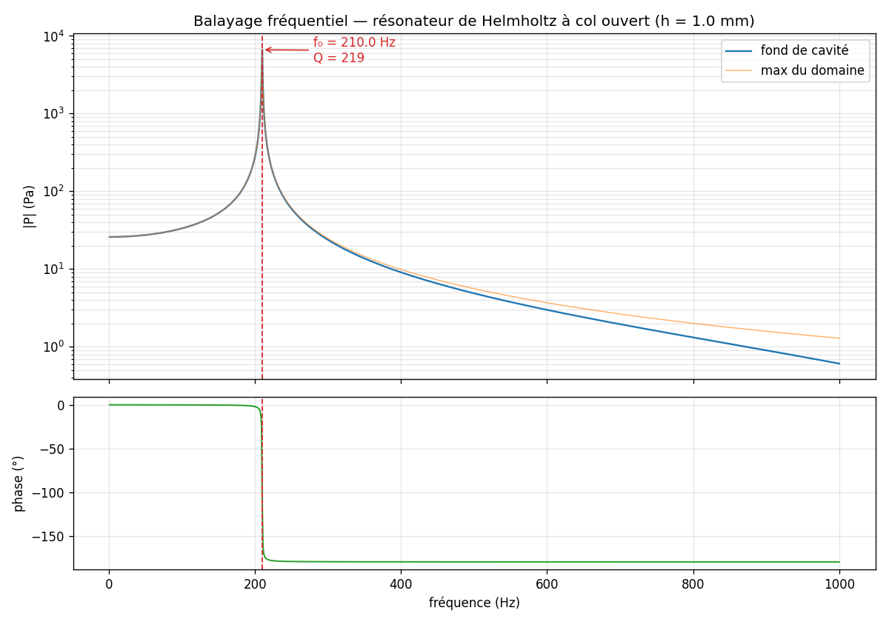
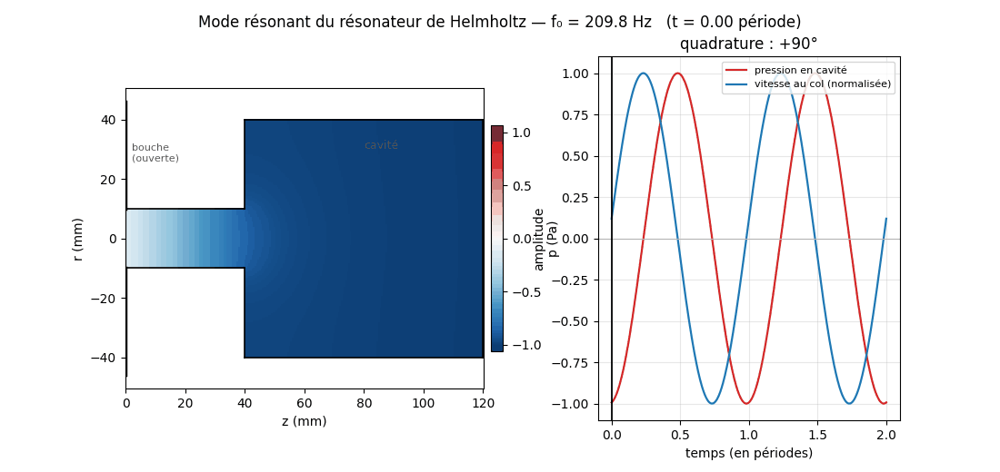

# Résonateur de Helmholtz — étude numérique par différences finies

Étude numérique d'un résonateur de Helmholtz axisymétrique, en deux volets complémentaires :

| # | Notebook | Question | Résultat vérifié |
|---|---|---|---|
| **1** | `etude_helmholtz.ipynb` | Où est la résonance et de quoi dépend-elle ? | V&V complète : MMS ordre **2,03**, GCI **≈2 %**, validation Selamet **0,6 / 2,2 %** |
| **2** | `resonance_transitoire.ipynb` | À quoi ressemble la résonance **en temps réel** ? | col ouvert + extérieur maillé → **f₀ = 204,6 Hz** (extrapolée, GCI 1,5 %), à **0,47 %** de la formule corrigée |


*L'impulsion se propage, entre par le col, la cavité se remplit — puis l'impulsion repart et la
cavité **sonne seule** à sa fréquence propre. Volet 2.*

## Démarrage

```bash
pip install -r requirements.txt
jupyter lab etude_helmholtz.ipynb          # volet 1 — FDM / V&V
jupyter lab resonance_transitoire.ipynb    # volet 2 — résonance en transitoire
```

Les notebooks sont livrés **avec leurs sorties** (figures visibles sans rien exécuter).

---

## Volet 1 — FDM : vérification, validation, longueur effective

| Niveau | Question | Méthode | Résultat |
|---|---|---|---|
| **Code** | le schéma est-il bien programmé ? | solution manufacturée (MMS) | ordre **2,03** |
| **Solution** | l'erreur de maillage est-elle bornée ? | convergence GCI (Roache) + 4ᵉ grille | incertitude **≈ 2 %** |
| **Modèle** | reproduit-il la réalité ? | mesures publiées (Selamet *et al.* 1997) | écarts **0,6 % / 2,2 %** |

- **Loi d'échelle** : après propagation de l'incertitude numérique, loi de puissance et modèle à
  longueur effective sont statistiquement indiscernables (ΔAICc non décisif) ; le modèle physique
  `f₀ = A_H/√(L+ΔL_eff)` est préféré (**A_H ≈ 48**, **ΔL_eff ≈ 0,66 R_col**, prédiction
  leave-one-out 10× meilleure). L'exposant apparent *b ≈ −0,42* est un artefact de plage restreinte.
- **Correction de bout** décomposée intérieur/extérieur via une condition d'impédance de rayonnement.
- **Pertes** dominées par la couche limite du col (**Q ≈ 47**) ; absorption volumique négligeable.

## Volet 2 — Résonance en régime transitoire (col ouvert, extérieur maillé)

Le col est **réellement ouvert** sur un demi-espace extérieur **maillé** (baffle plan, couches
absorbantes), excité par une **impulsion large bande**. Le résonateur **sélectionne** sa fréquence
propre : après le passage de l'impulsion, la cavité continue d'osciller.

| Grandeur | Mesuré | Référence | Écart |
|---|---|---|---|
| f₀ **extrapolée à maillage nul** | **204,6 Hz** (GCI 1,5 %) | Helmholtz **avec** corrections de bout : 205,6 Hz | **0,47 %** |
| — | — | Helmholtz **sans** correction : 241,3 Hz | 15 % |
| Ordre de convergence observé | 0,86 | 3 grilles : 2 / 1 / 0,5 mm | — |
| Q par rayonnement | **non mesurable ici** | varie d'un facteur 6 selon les frontières | artefact numérique |

Le maillage extérieur **calcule** la correction de bout au lieu de la postuler : c'est la
**perspective n°1** du projet, désormais réalisée.

**Vérification (ajoutée après coup, et elle corrige deux résultats).** Le solveur place ses parois
une demi-maille au-delà du dernier nœud — la géométrie simulée vaut donc `R+h/2` et `H+h`, ce qui
biaise f₀ au premier ordre. Trois conséquences :

- la fréquence brute à h=1 mm (209,8 Hz) semblait coïncider avec le calcul fréquentiel par
  impédance (209,84 Hz) ; cette coïncidence était **fortuite**, due au biais de maillage ;
- une fois extrapolée, f₀ = **204,6 Hz**, à 0,47 % de la théorie corrigée — un accord plus faible
  en apparence, mais cette fois **contrôlé** et assorti d'une incertitude ;
- f₀ est **parfaitement robuste** au traitement des frontières (variation 0,00 %), alors que **Q
  varie d'un facteur 6** : ce calcul mesure une fréquence propre, pas un amortissement.

Vérification de code : `mms_transient.py` (solution manufacturée espace-temps, **ordre 1,98**),
qui teste le masque, les flux nuls et l'axe — ce que la MMS du volet 1 ne couvrait pas.

### Balayage fréquentiel complet — `fdm_sweep.py`

Mille résolutions harmoniques de **1 à 1000 Hz en 77 secondes**, avec condition d'impédance de
rayonnement à la bouche. À comparer aux 7 à 17 heures qu'aurait coûté un balayage transitoire
équivalent : 10 s de signal à `dt_CFL = 0,825 µs`, soit **1,21 × 10⁷ pas de temps**.

| Grandeur | Pas de 1 Hz | Pas de 0,005 Hz |
|---|---|---|
| Pic de résonance | 209,95 Hz | **209,84 Hz** |
| Amplitude au pic | 6 622 Pa | **7 251 Pa** |
| Bande à −3 dB | 0,96 Hz | 0,73 Hz |
| Facteur de qualité Q | 218,6 | 285,6 |
| Gain par rapport à 1 Hz | **255×** | — |

> **Le premier passage sous-estimait le pic de 9 %.** La bande à −3 dB fait 0,73 Hz, soit
> **moins que le pas d'échantillonnage de 1 Hz** : le pic n'était tout simplement pas résolu.



### Validation croisée des deux solveurs

Les deux solveurs ont été extrapolés à maillage nul par la méthode de Richardson.

| Grandeur | Solveur fréquentiel | Solveur transitoire |
|---|---|---|
| Ordre observé | **0,933** | **0,863** |
| f₀ extrapolée | **203,35 Hz** | **204,60 Hz** |
| GCI | 2,05 % | 1,54 % |
| Intervalle | 199,2 – 207,5 Hz | 201,4 – 207,8 Hz |

Les deux extrapolations diffèrent de **0,61 %**, largement à l'intérieur des barres
d'incertitude, et la **théorie de Helmholtz corrigée (205,56 Hz) tombe dans les deux
intervalles**. Deux solveurs indépendants, deux modèles de rayonnement différents, même réponse :
validation croisée **contrôlée**, et non fortuite.

Les deux ordres observés valent ~0,9 et non 2 : le biais de demi-maille est présent dans les
**deux** solveurs. En revanche **Q diverge d'un facteur 2,7** selon le modèle de rayonnement —
285,6 par impédance analytique contre 105 par extérieur maillé. Ce projet mesure très bien une
fréquence propre, et mal un amortissement.

### Animation du mode établi — `make_mode_anim.py`



*Quadrature mesurée à **+90,2°** entre la vitesse au col et la pression en cavité — signature du
système masse-ressort : le bouchon d'air du col est la masse, l'air de la cavité le ressort.*


## Reproduire

```bash
python fdm_open_resonator.py          # volet 2 : résonance transitoire (~6 min)
python fdm_sweep.py                   # balayage fréquentiel 1-1000 Hz (77 s)
python mms_transient.py               # vérification de code du transitoire (~10 s)
python convergence_f0.py              # convergence en maillage de f0
python make_resonance_anim.py         # animation (après un run OR_TAG=_anim, cf. notebook)
python make_mode_anim.py              # animation du mode résonant établi (~30 s)

```

## Contenu

```
etude_helmholtz.ipynb          volet 1 — FDM fréquentiel, V&V, longueur effective
resonance_transitoire.ipynb    volet 2 — résonance transitoire (col ouvert)
fdm_open_resonator.py          solveur transitoire col ouvert + extérieur maillé
mms_transient.py               vérification de code du transitoire (MMS espace-temps)
convergence_f0.py              convergence en maillage de f0 + extrapolation
make_resonance_anim.py         animation du régime transitoire
make_mode_anim.py              animation du mode résonant établi (quadrature col/cavité)
build_resonance_notebook.py    génération du notebook du volet 2
explication_scientifique.pdf   article du volet 1
docs/PROTOCOLE_EXPERIMENTAL.md protocole de mesure sur résonateur réel
data/  plots/                  données et figures
docs/PROTOCOLE_EXPERIMENTAL.md protocole de mesure sur résonateur réel
```

## Perspectives

PML formelle au lieu des couches absorbantes ; pertes viscothermiques résolues
dans le transitoire ; col émergeant sans baffle ; campagne expérimentale (cf. `docs/`).
Le facteur de qualité reste non tranché — 285,6 par impédance analytique contre 105 par
extérieur maillé : ce projet mesure très bien une fréquence propre, et mal un amortissement.
